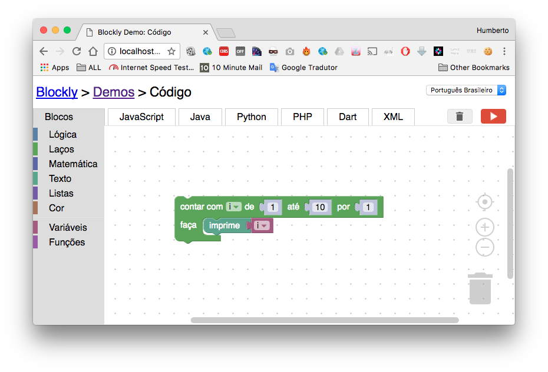
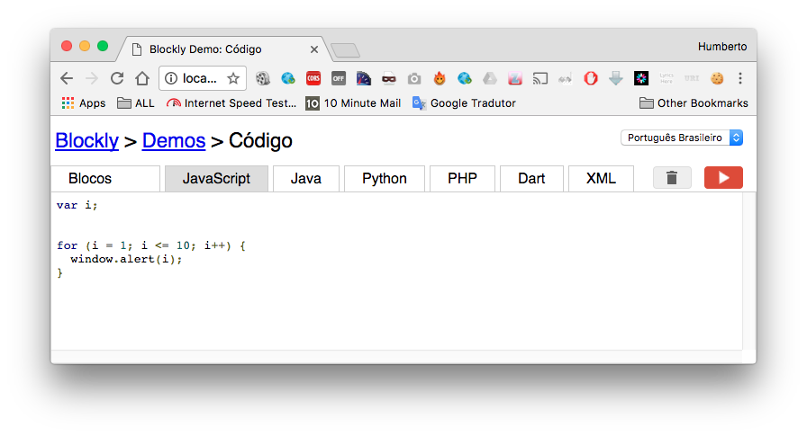
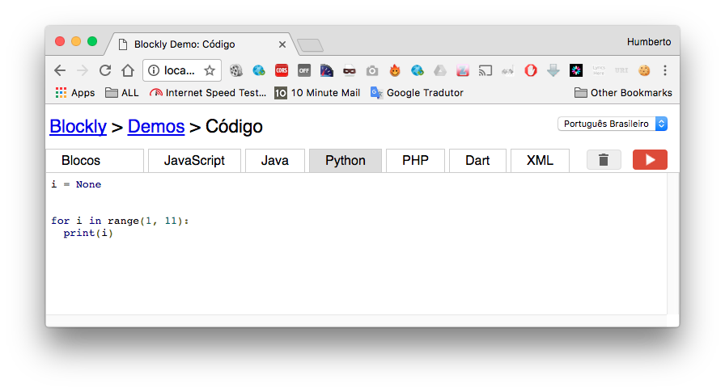
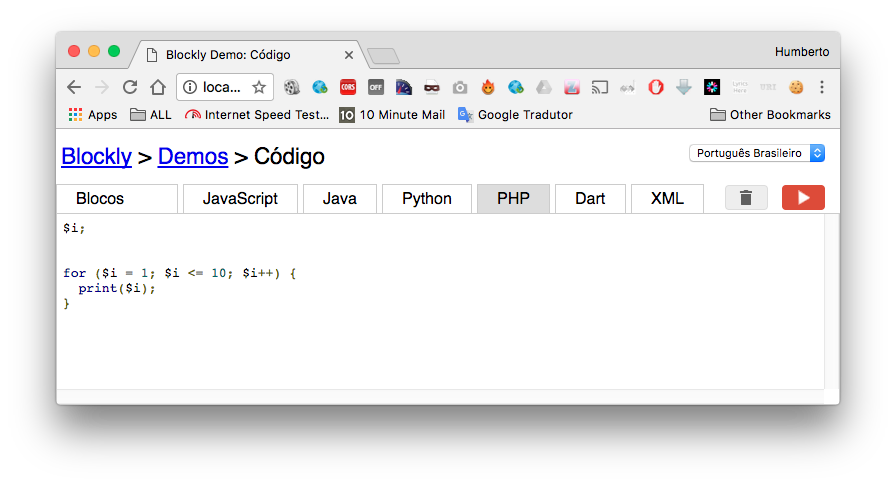
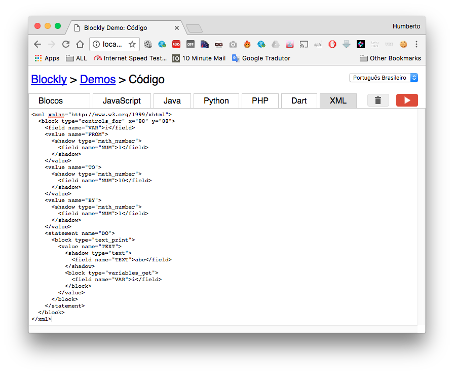

# Editor de Código Visual

Editor Visual de Código utilizando Blockly


# Executando

Python2
```
python -m SimpleHTTPServer 8000
```
ou

Python3
```
python -m http.server 8000
```

http://localhost:8000/demos/code/index.html

### Editor Visual



JavaScript



Java


Python



PHP



Dart


XML




# Referências

1. [Blockly Repository](https://github.com/google/blockly)
